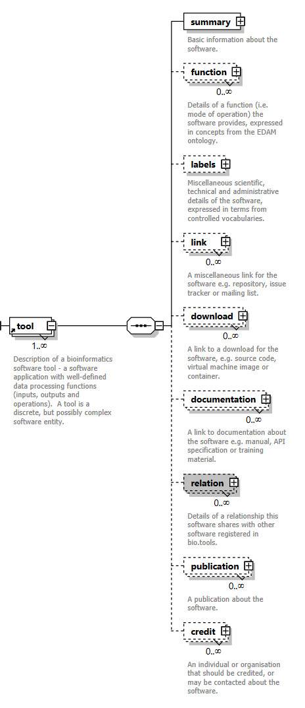
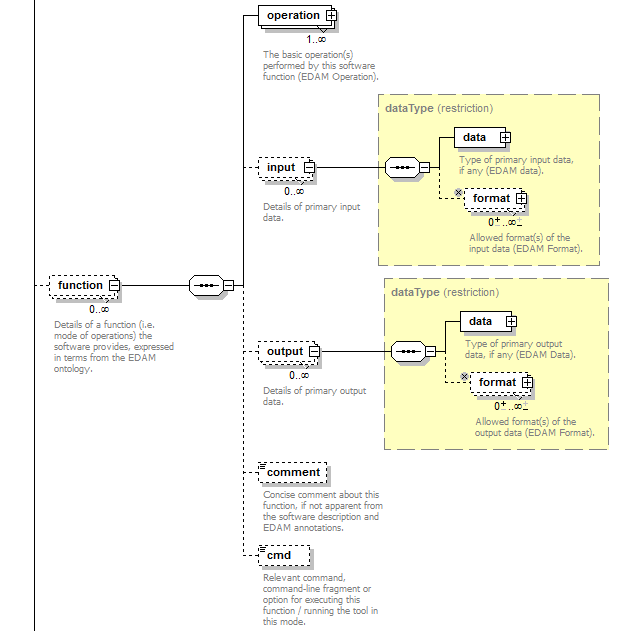

biotoolsSchema elements
=======================

Element groups
--------------
biotoolsSchema includes scientific, technical and administrative software attributes, organised for convenience into 10 logical groupings (see below).

.. csv-table::
   :header: "Group", "XSD element", "Description"
   :widths: 25, 50, 50, 100
      
   "Summary", "summary", "Basic information about the software."
   "Function", "function", "Details of the function(s) (i.e. modes of operation) the software provides, expressed in terms from the EDAM ontology."
   "Labels", "label", "Miscellaneous scientific, technical and administrative details of the software, expressed in terms from controlled vocabularies."
   "Links", "lnk", "Miscellaneous links for the software e.g. repository, issue tracker or mailing list."
   "Downloads", "download", "Links to downloads for the software, e.g. source code, virtual machine image or container."
   "Documentation", "documentation", "Links to documentation about the software e.g. manual, API specification or training material."
   "Publications", "publication", "Publications about the software."
   "Credits", "credit", "Individuals or organisations that should be credited, or may be contacted about the software."

Elements
--------

Summary group
^^^^^^^^^^^^^
*Basic information about the software.*

	   
.. csv-table::
   :header: "Element", ""Description", "Type", "Cardinality"
   :widths: 25, 50, 50, 100
      
   "name", "Canonical software name assigned by the software developer or service provider.", "xs:token (restriction)", "1 only"
   "shortDescription", "Short and concise textual description of the software function.", "xs:token (restriction)", "0 or 1"
   "description", "Textual description of the software.", "xs:token (restriction)", "1 only"
   "homepage", "Homepage of the software, or some URL that best serves this purpose.", "URL", "1 only"
   "biotoolsId", "Unique ID (case insensitive) of the tool that is assigned upon registration of the software in bio.tools, normally identical to tool name.", "URL (restriction)", "0 or 1"
   "biotoolsCURIE ", "bio.tools CURIE (compact URI) based on the bio.tools tool ID.", "xs:token (restriction)", "0 or 1"
   "version", "Version information (typically a version number) of the software applicable to this bio.tools entry.", "xs:token (restriction)", "0 or more"
   "otherID", "A unique identifier of the software, typically assigned by an ID-assignment authority other than bio.tools.", "(see below)", "0 or more"
   "otherID->value", "Value of tool identifier.", "xs:token (restriction)", "1 only"
   "otherID->type", "Type of tool identifier.", "enum (see Table XXX)", "0 or 1"
   "otherID->version", "Version information (typically a version number) of the software applicable to this identifier.", "xs:token (restriction)", "0 or 1"

	    
Function group
^^^^^^^^^^^^^^
*Details of a function (i.e. mode of operation) the software provides, expressed in terms from the EDAM ontology.*

Each software entity has one more functions, each corresponding to a mode of operation that the software provides.  Each function performs one or more basic operations, and has zero or more primary input and/or output data, each of a specified type and supported format(s).  For each operation, data or format, an EDAM concept URL and (optionally) term are specified.  The URL must be in the appropriate EDAM Operation | Data | Format namespace, *i.e.* http://edamontology.org/operation_ | data_ | format_.  The term, *e.g.* "Multiple sequence alignment" must be either the preferred label of the concept or a synonym of this term, as defined in EDAM.

.. csv-table::
   :header: "Element", ""Description", "Type", "Cardinality"
   :widths: 25, 50, 50, 100

   "Attribute", "Description", "Type", "Cardinality"
   "operation", "The basic operation(s) performed by this software function (EDAM Operation).", "Ontology concept (restriction)", "1 or more"
   "input", "*Details of primary input data.*", "-", "-"
   "input->data", "Type of primary input data, if any (EDAM data). ", "Ontology concept (restriction)", "1 only"
   "input->format", "Allowed format(s) of the input data (EDAM Format). ", "Ontology concept (restriction)", "0 or more"
   "output", "*Details of primary output data.*", "-", "-"
   "output->data", "Type of primary output data, if any (EDAM Data).", "Ontology concept (restriction)", "1 only"
   "output->format", "Allowed format(s) of the output data (EDAM Format).", "Ontology concept (restriction)", "0 or more"
   "operation | data | format | topic->url", "URL of an EDAM Operation | Data | Format concept.", "URL (restriction)",  "0 or 1"
   "operation | data | format | topic->term", "An EDAM Operation | Data | Format term (preferred label or synonym).", "xs:token", "0 or 1"
   "comment", "Concise comment about this function, if not apparent from the software description and EDAM annotations.", "xs:token (restriction)", "0 or 1"
   "cmd", "Relevant command, command-line fragment or option for executing this function / running the tool in this mode.", "xs:token (restriction)", "0 or 1"
   
   
Labels group
^^^^^^^^^^^^
*Miscellaneous scientific, technical and administrative details of the software, expressed in terms from controlled vocabularies.*

.. image:: images/labels.png
	   
.. csv-table::
   :header: "Element", ""Description", "Type", "Cardinality"
   :widths: 25, 50, 50, 100
	    
   "Attribute", "Description", "Type", "Cardinality"
   "toolType", "A type of application software: a discrete software entity can have more than one type.", "enum (see Table XXX)", "0 or more"
   "topic", "General scientific domain the software serves or other general category: one of EDAM Topic URL or term is specified.", "Ontology concept (restriction)", "0 or more"
   "topic->url", "URL of an EDAM Topic concept.", "URL (restriction)", "0 or 1"
   "topic->term", "An EDAM Topic term (preferred label or synonym).", "xs:token", "0 or 1"
   "goTermID", "Gene function including molecular function, cellular component and biological process.  Miscellaneous ontology annotation. The ID of Gene Ontology (GO) concept(s) are specified.", "xs:token (restriction)", "0 or more"
   "soTermID", "Features which can be located on a biological sequence. The ID of Sequence Ontology (SO) concept(s) are specified.", "xs:token (restriction)", "0 or more"
   "taxId", "NCBI taxonomy ID of taxonomic group the software (particularly database portals) caters for.", "xs:token (restriction)", "0 or more"
   "operatingSystem", "The operating system supported by a downloadable software package.", "enum (see below)", "0 or more"
   "language", "Name of programming language the software source code was written in.", "enum", "0 or more"
   "license", "Software or data usage license.", "enum", "0 or 1"
   "collectionID", "Tag for a collection that the software has been assigned to within bio.tools.", "xs:token (restriction)", "0 or more"
   "maturity", "How mature the software product is.", "enum", "0 or 1"
   "cost", "Monetary cost of acquiring the software.", "enum", "0 or 1"
   "accessibility", "Whether the software is freely available for use.", "enum)", "0 or more"

Relation group
^^^^^^^^^^^^^^
*Details of a relationship this software shares with other software registered in bio.tools.*

See the `GitHub docs <https://github.com/bio-tools/biotoolsSchema/tree/master/versions/biotools-3.0.0-rc/docs>`_.

API spec group
^^^^^^^^^^^^^^
*Details of the API to a service including service endpoints.*

See the `GitHub docs <https://github.com/bio-tools/biotoolsSchema/tree/master/versions/biotools-3.0.0-rc/docs>`_.

Links group
^^^^^^^^^^^
*Miscellaneous links for the software e.g. repository, issue tracker or mailing list.*

.. image:: images/link.png

.. csv-table::
   :header: "Element", ""Description", "Type", "Cardinality"
   :widths: 25, 50, 50, 100
	    
   "Element", "Description", "Type", "Cardinality"
   "url", "A link of some relevance to the software (URL).", "URL", "1 only"
   "type", "The type of data, information or system that is obtained when the link is resolved.", "enum (Table XXX)", "1 only"
   "comment", "Comment about the link.", "xs:token (restriction)", "0 or more"
   "isAvailable", "Used (with value of "Not available") when a link of a certain type is known not to be available.", "enum ('Not available')", "0 or 1"

Download group
^^^^^^^^^^^^^^
*Links to downloads for the software, e.g. source code, virtual machine image or container.*

.. image:: images/download.png

.. csv-table::
   :header: "Element", ""Description", "Type", "Cardinality"
   :widths: 25, 50, 50, 100

   "Element", "Description", "Type", "Cardinality"
   "url", "Link to download (or repo providing a download) for the software.", "URL", "1 only"
   "type", "Type of download that is linked to.", "enum (Table XXX)", "1 only"
   "comment", "Comment about the download.", "xs:token (restriction)", "0 or 1"
   "diskFormat", "Virtual machine image disk format.", "enum (Table XXX)", "0 or 1"
   "containerFormat", "Virtual machine container format.", "enum (Table XXX)", "0 or 1"
   "cmd", "A useful command pertinent to the download, e.g. for getting or installing a tool.", "xs:token (restriction)", "0 or 1"
   "version", "Version information (typically a version number) of the software applicable to this download.", "xs:token (restriction)", "0 or 1"
   "isAvailable", "Used (with value of "Not available") when a download of a certain type is known not to be available.", "enum ('Not available')", "0 or 1"

Documentation group
^^^^^^^^^^^^^^^^^^^
*Links to documentation about the software e.g. manual, API specification or training material.*

.. image:: images/documentation.png
	   
.. csv-table::
   :header: "Element", ""Description", "Type", "Cardinality"
   :widths: 25, 50, 50, 100
	    
   "Element", "Description", "Type", "Cardinality"
   "url", "Link to documentation on the web for the tool.", "URL", "1 only"
   "type", "Type of documentation that is linked to.", "enum (Table XXX)", "1 only"
   "comment", "Comment about the documentation.", "xs:token (restriction)", "0 or more"
   "isAvailable", "Used (with value of "Not available") when documentation of a certain type is known not to be available.", "enum ('Not available')", "0 or 1"

   
Publications group
^^^^^^^^^^^^^^^^^^
*Publications about the software*

.. image:: images/publication.png
	   
.. csv-table::
   :header: "Element", ""Description", "Type", "Cardinality"
   :widths: 25, 50, 50, 100
	    
   "Attribute", "Description", "Type", "Cardinality"
   "pmcid", "PubMed Central Identifier of a publication about the software.", "xs:token (restriction)", "1 only"
   "pmid", "PubMed Identifier.", "xs:token (restriction)", "1 only"
   "doi", "Digital Object Identifier.", "xs:token (restriction)", "1 only"
   "type", "Type of publication.", "enum (Table XXX)", "0 or 1"
   "version", "Version information (typically a version number) of the software applicable to this publication.", "xs:token (restriction)", "0 or 1"
   "isAvailable", "Used (with value of "Not available") when a publication is known not to be available.", "enum ('Not available')", "0 or 1"
   
Credits group
^^^^^^^^^^^^^
*Individuals or organisations that should be credited, or may be contacted about the software.*

.. image:: images/credit.png
	   
.. csv-table::
   :header: "Element", ""Description", "Type", "Cardinality"
   :widths: 25, 50, 50, 100
	    
   "Attribute", "Description", "Type", "Cardinality"
   "name", "Name of the entity that is credited.", "xs:token (restriction)", "1 only"
   "orcidId", "Unique identifier (ORCID iD) of a person that is credited.", "xs:token (restriction)", "0 or 1"
   "gridId", "Unique identifier (GRID ID) of an organisation that is credited.", "xs:token (restriction)", "0 or 1"
   "email", "Email address.", "email address", "0 or 1"
   "url", "URL, e.g. homepage of an institute.", "URL", "0 or 1"
   "tel", "Telephone number.", "xs:token (restriction)", "0 or 1"
   "typeEntity", "Type of entity that is credited.", "enum (see Table XXX)", "0 or 1"
   "typeRole", "Role performed by entity that is credited.", "enum (see Table XXX)", "0 or more"
   "comment", "A comment about the credit.", "xs:token (restriction)", "0 or 1"
