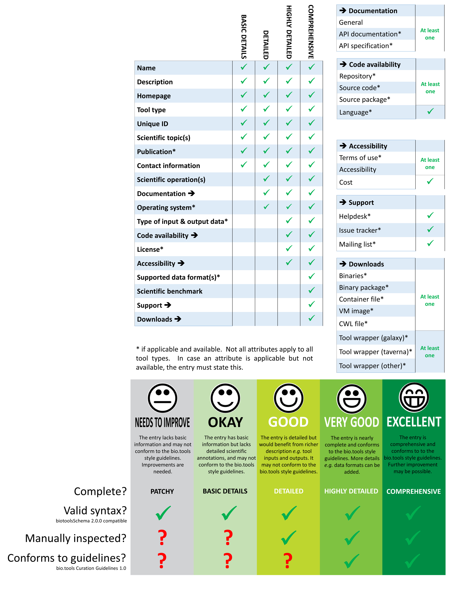

Information requirement
=======================

bio.tools information standard
------------------------------

**The standard described below represents a "respectable beta" and will be implemented in https://bio.tools.**  Please join the `discussion on GitHub <https://github.com/bio-tools/biotoolsSchema/issues/77>`_

`biotoolsSchema <https://github.com/bio-tools/biotoolsSchema/>`_ provides the foundation for an *information standard* for the description of tools that is being adopted by https://bio.tools.  The standard has two components:

* a list of tool attributes (see Table below) that must be specified (or stated as not being available) for an entry to be assigned in a 5 tier rating of entry completeness and quality.  Some attributes are grouped (see tables on right) for purposes of determining adherance to the standard.
* a set of `Curation Guidelines <http://biotools.readthedocs.io/en/latest/curators_guide.html>`_ describing *how* each attribute should be specified, *i.e.* things that go beyond syntactic and semantic constraints defined by `biotoolsSchema <https://github.com/bio-tools/biotoolsSchema/>`_.

Adherence to some of guidelines is verified by automated QC checks within bio.tools, whereas others must be verified by manual inspection.

The standard provides a basis for labelling of bio.tools entries in various ways:

* label of *entry completeness* (from "PATCHY" through to "COMPREHENSIVE")
* label indicating whether an entry had been manually inspected
* label indicating whether an entry conforms to the guidelines, passing both the automated and manual checks ("Verified" label and stamped with date of verification and last update)
* label of overall *entry quality* (from "NEEDS TO IMPROVE" through to "EXCELLENT") conflating notions above

If and how to use labels is currently `under discussion <https://github.com/bio-tools/biotoolsSchema/issues/77>`_.
  

Why is a standard needed at all?
--------------------------------	   
There are several reasons why a community-defined standard for tool information is helpful:

* accessible summary of what type of information bio.tools provides
* flexible information requirement, including a minimum requirements presenting a low barrier to new registrations, compatible / enabling integration with other major related cataloguing efforts (e.g. BioContainers)
* quality tiers motivate individual entry owners to improve their entries (curation as a "game"), with a "gold standard" of entry quality for curators to aspire to  
* a framework / workflow to guide tasks and priorities of curators, thematic editors and bio.tools admin
* a basis for metrics of bio.tools quality, KPIs (key performance indicators) of quality improvement objectives, and targets
* a component of branding bio.tools as a trusted source of quality tool information

   
Description of attributes
-------------------------

Attributes defined as mandatory in the latest stable schema (`biotools-2.0.0 <https://github.com/bio-tools/biotoolsSchema/tree/master/versions/biotools-2.0.0>`_) are those in the "OKAY" tier plus  "Scientific operation" from the "GOOD" tier.

General attributes
^^^^^^^^^^^^^^^^^^
.. csv-table:: 
   :header: "Attribute", "Description", "Format", "element"
   :widths: 15, 75, 10, 10
	    
   "**Name**", "Canonical software name assigned by the software developer or service provider", "Text", "``<name>``"
   "**Description**", "Short and concise textual description of the software function", "Text", "``<description>``"
   "**Homepage**", "Homepage of the software, or some URL that best serves this purpose", "URL", "``<homepage>``"
   "**Tool type**", "The type of application software: a discrete software entity can have more than one type.", "enum (from biotoolsSchema, see below)", "``<toolType>``"
   "**Unique ID**", "Unique ID of the tool that is assigned upon registration of the software in bio.tools", "Text (URL-safe version of tool name)", "``<toolID>``"
   "**Scientific topics**", "General scientific domain the software serves or other general category, *e.g.* 'Proteomics'", "Term and / or URI of `EDAM Topic <http://edamontology.org/topic_0004>`_ concept(s) (1)", "``<topic>``"
   "**Publications**", "Publications about the software", "DOI, PMID or PMCID", "``<publication>``"
   "**Contact information**", "Primary contact, *e.g.* a person, helpdesk or mailing list", "Email address and / or URL",  "``<contact>``"
   "**Scientific operations**", "The basic operation(s) performed by the software, *e.g.* 'Multiple sequence alignment'", "Term and / or URI of `EDAM Operation <http://edamontology.org/operation_0004>`_ concept(s)", "``<function><operation>``"
   "**Operating system**", "The operating system supported by a downloadable software package.", "enum (from biotoolsSchema)", "``<labels><OperatingSystem>``"
   "**Type of input & output data**", "Type of primary input / output data (if any), *e.g.* 'Protein sequences'", "Term and / or URI of `EDAM Data <http://edamontology.org/data_0006>`_ concept(s)", "``<function><input>/<output><data>``"
   "**Supported data formats**", "Allowed format(s) of primary inputs/outputs, *e.g.* 'FASTA'", "Term and / or URI of `EDAM Format <http://edamontology.org/format_1915>`_ concept(s)", "``<function><input>/<output><format>``"
    "**License**", "Software or data usage license", "enum (from biotoolsSchema)", "``<labels><license>``"
    "**Scientific benchmark**", "Scientific benchmarking results.", "tbd", "n/a"

"Documentation" group
^^^^^^^^^^^^^^^^^^^^^
.. csv-table:: 
   :header: "Attribute", "Description", "Format", "element"
   :widths: 15, 75, 10, 10
    
   "**General documentation**", "General documentation", "URL", "``<documentation><type>General</type>``"
   "**API documentation**", "Human-readable API documentation.", "URL", "``<documentation><type>API documentation</type>``"
   "**API specification**", "File providing an API specification for the software, e.g. Swagger/OpenAPI, WSDL or RAML file.", "URL", "``<download><type>API specification</type>``"

"Code availability" group
^^^^^^^^^^^^^^^^^^^^^^^^^    
.. csv-table:: 
   :header: "Attribute", "Description", "Format", "element"
   :widths: 15, 75, 10, 10

   "**Repository**", "Link to repository where source code, data and other files may be downloaded", "URL", "``<link><type>Repository</type>``"
   "**Source code**", "Software source code.", "URL", "``<download><type>Source code</type>``"
   "**Source package**", "Source package (of various types) for the software.", "URL", "``<download><type>Source package</type>``"
   "**Language**", "Name of programming language the software source code was written in.", "enum (from biotoolsSchema)", "``<labels><Language>``"

"Accessibility" group
^^^^^^^^^^^^^^^^^^^^^
.. csv-table:: 
   :header: "Attribute", "Description", "Format", "element"
   :widths: 15, 75, 10, 10

   "**Terms of use**", "Rules that one must agree to abide by in order to use a service.", "URL", "``<link><type>Terms of use</type>``"
   "**Accessibility**", "Whether the software is freely available for use.", "enum (from biotoolsSchema)", "``<labels><Accessibility>``"
   "**Cost**", "Monetary cost of acquiring the software.", "enum (from biotoolsSchema)", "``<labels><Cost>``"

"Support" group
^^^^^^^^^^^^^^^^^
.. csv-table:: 
   :header: "Attribute", "Description", "Format", "element"
   :widths: 15, 75, 10, 10

   "**Helpdesk**", "Helpdesk providing support in using the software.", "URL", "``<link><type>Helpdesk</type>``"
   "**Issue tracker**", "Link to tracker for software issues, bug reports, feature requests etc.", "URL", "``<link><type>Issue tracker</type>``"
   "**Mailing list**", "Link to mailing list for software announcements, discussions, support etc.", "URL", "``<link><type>Mailing list</type>``"

   
"Downloads" group
^^^^^^^^^^^^^^^^^
.. csv-table::
   :header: "Attribute", "Description", "Format", "element"
   :widths: 15, 75, 10, 10

   "**Binaries**", "Binaries for the software.", "URL", "``<download><type>Binaries</type>``"
   "**Binary package**", "Binary package for the software.", "URL", "``<download><type>Binary package</type>``"
   "**Container file**", "Container file including the software.", "URL", "``<download><type>Container file</type>``"
   "**VM image**", "Virtual machine (VM) image for the software.", "URL", "``<download><type>VM image</type>``"
   "**CWL file**", "Common Workflow Language (CWL) file for the software.", "URL", "``<download><type>CWL file</type>``"
   "**Tool wrapper (galaxy)**", "Galaxy tool configuration file (wrapper) for the software.", "URL", "``<download><type>Tool wrapper (galaxy)</type>``"
   "**Tool wrapper (taverna)**", "Taverna configuration file for the software.", "URL", "``<download><type>Tool wrapper (taverna)</type>``"
   "**Tool wrapper (other)**", "Workbench configuration file (other than taverna, galaxy or CWL wrapper) for the software.", "URL", "``<download><type>Tool wrapper (other)</type>``"

  
.. note:: (1) EDAM is a simple ontology of well established, familiar concepts that are prevalent within bioinformatics, including types of data and data identifiers, data formats, operations and topics. EDAM provides a set of terms with synonyms and definitions - organised into an intuitive hierarchy for convenient use.  You can find `EDAM on GitHub <https://github.com/edamontology/edamontology>`_.
